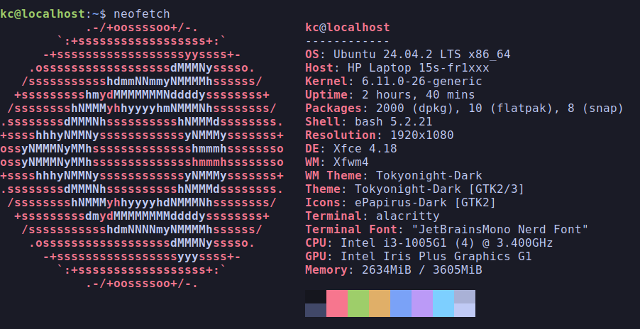
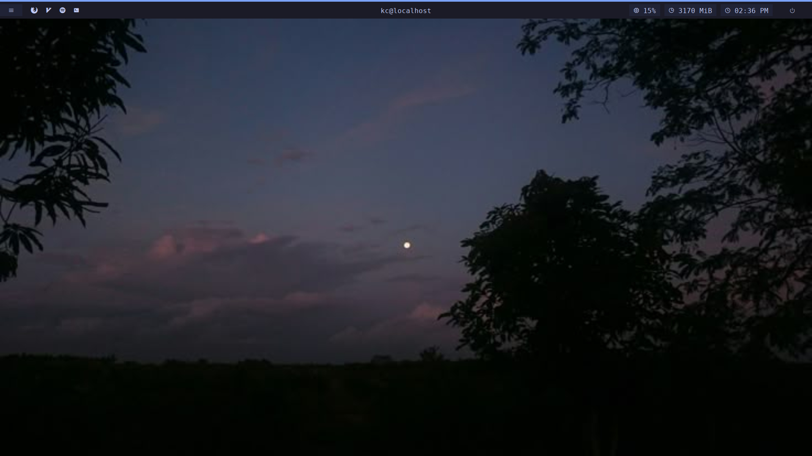
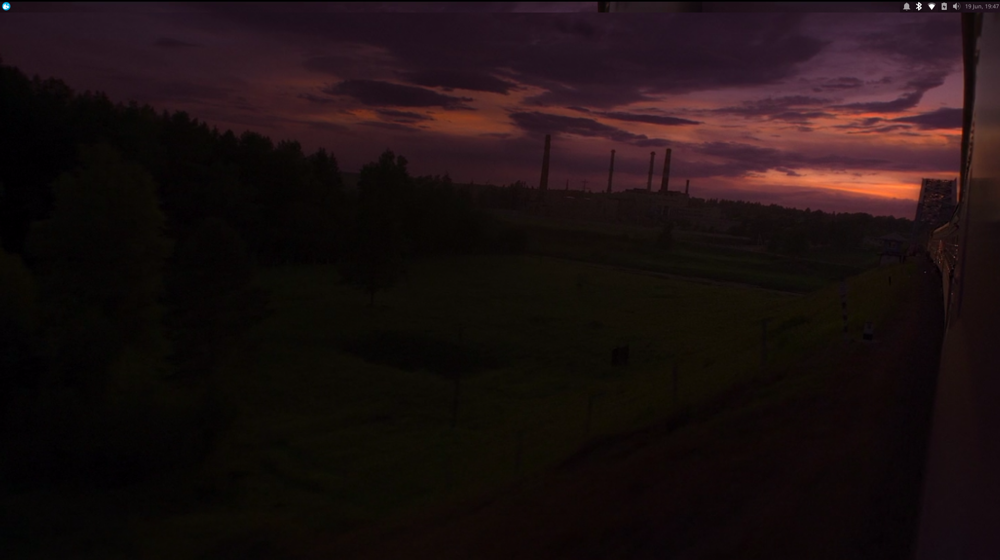
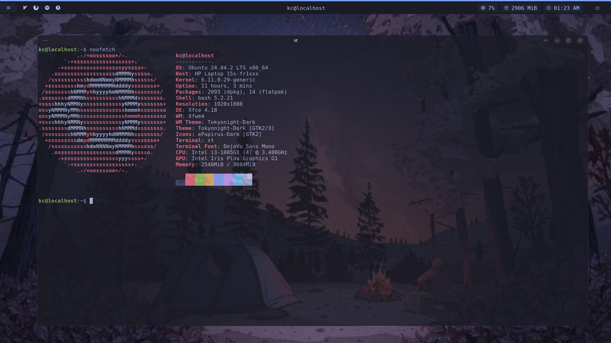

# what's in this repo?    

- **Theme**: TokyoNight (Dark)
- **Icons**: ePapirus Dark
- **Font**: JetBrainsMono Nerd Font
- **Terminal**: Alacritty/ST (i use alacritty when i need gpu rendering related work, st for basic use)
- **Shell**: Bash 5.2.21
- **Launcher**: Rofi (Adi1090x theme)
- **Powermenu**: Rofi
- **Panel**: Polybar
- **DE/WM**: XFCE + dwm
- **Compositor**: Picom

# neofetch

# screenshot(s) of my rice

# small note

you might be wondering why i have dwm AND xfwm, well it's temporary, right now my main wm is XFWM, i'm slowly migrating to dwm so that's that
