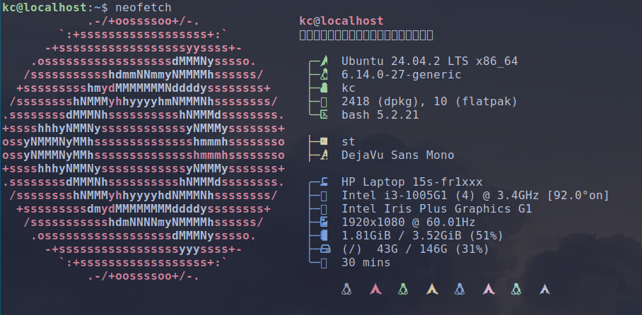
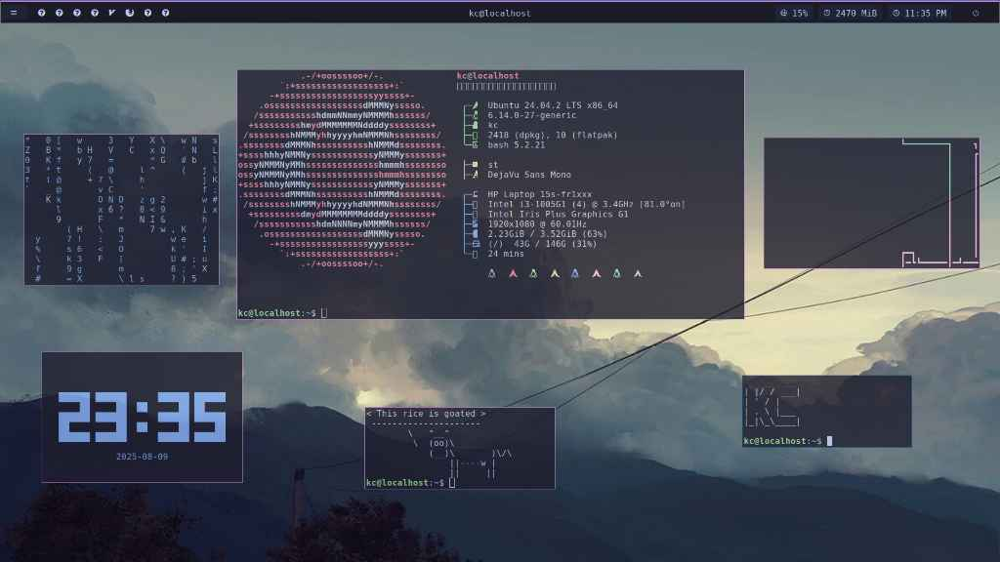

# what's in this repo?    

- **Theme**: Catppuccin Mocha Lavender (Dark)
- **Icons**: Catppuccin Mocha Lavender
- **Font**: JetBrainsMono Nerd Font
- **Terminal**: Alacritty/ST (i use alacritty when i need gpu rendering related work, st for basic use)
- **Shell**: Dash for daily drive, Bash for whenever i feel like it
- **Launcher**: Rofi 
- **Powermenu**: Rofi
- **Panel**: Polybar / dwmblocks
- **DE/WM**: XFCE + dwm
- **Compositor**: Picom

# neofetch

# screenshot(s) of my rice

# configs to ignore
i was trying to get dwmblocks to render some colors with shell scripts but i've failed terribly   
then naturally, i decided the logical next step to waste time was to re-structure my entire dotfiles directory and make it more "organized" so my heart feels content  
i really need better hobbies bro smh  
but yeah my dwmblocks configs are broken so i'd suggest not to play with them
