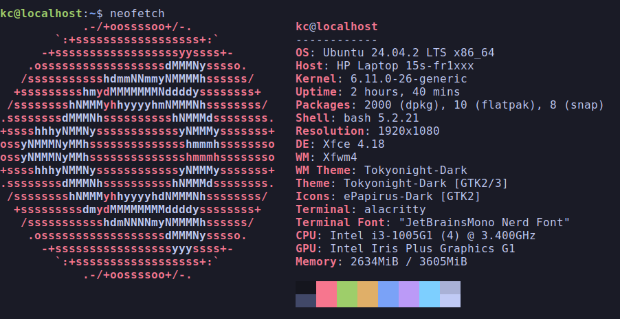
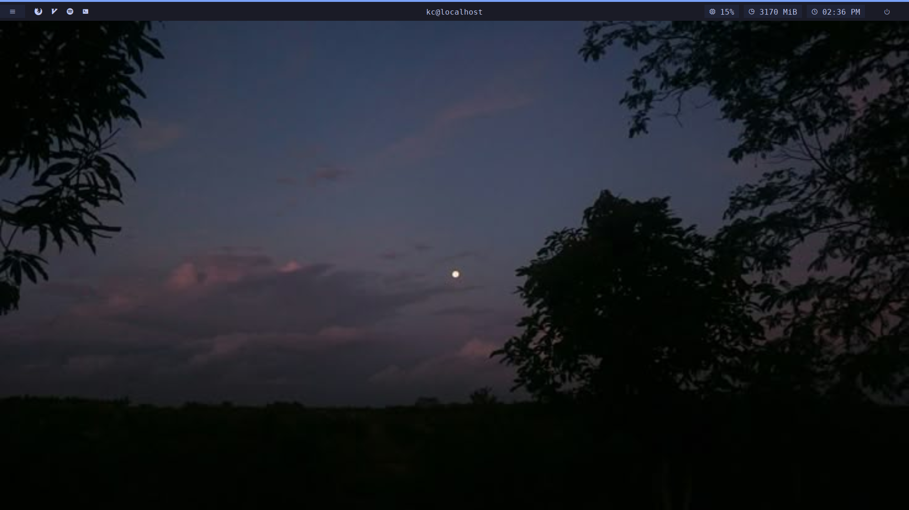
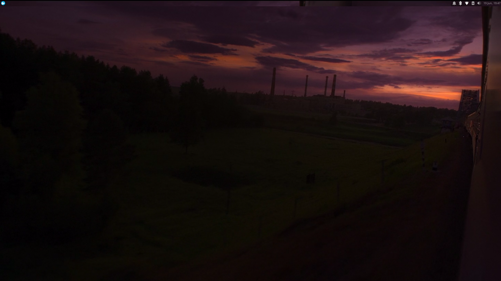

# what's in this repo? <Br> <br>

# Scripts 
```
.
├── mouseaccel.sh
├── panelswitch.sh
├── picomLaunch.sh
└── updateDotFiles.sh

```
<br><br>
``mouseaccel.sh`` is used for disabling mouse acceleration (basically pointer precision) <br>
``panelswitch.sh`` is used for switching between polybar and xfce panel, (polybar configs/dotfiles aren't uploaded here as i'm still configuring/learning) <br>
``picomLaunch.sh`` launches picom, an alternative to the default xfce4 compositor (it's a lot more lightweight) <Br> <br>
``updateDotFiles.sh`` is used for updating my dotfiles (bash, nvim, xfce)<br>

# Wallpapers, Bash, nvim, XFCE, alacritty and Picom
all my configurations


# neofetch



# screenshot(s) of my rice





