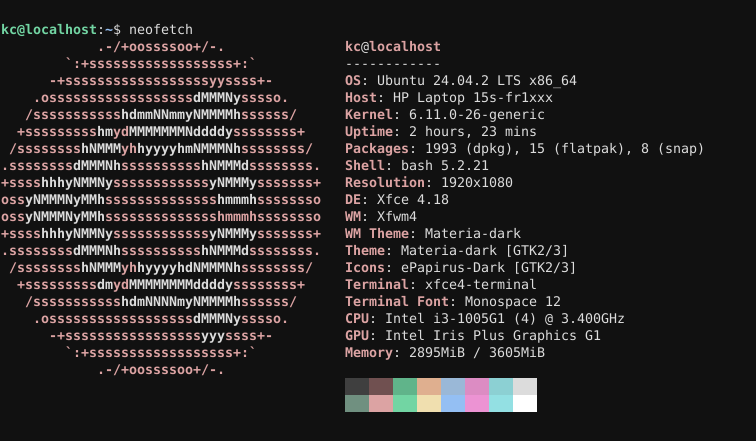

# what's in this repo? <Br> <br>

# Scripts 
```
/home/kc/Scripts
├── mouseaccel.sh
├── panelswitch.sh
└── updateDotFiles.sh
```
<br><br>
``mouseaccel.sh`` is used for disabling mouse acceleration (basically pointer precision) <br>
``panelswitch.sh`` is used for switching between polybar and xfce panel, (polybar configs/dotfiles aren't uploaded here as i'm still configuring/learning) <br>
``updateDotFiles.sh`` is used for updating my dotfiles (bash, nvim, xfce)<br>

# Wallpapers
The wallpapers I use

# Bash
My bash configurations

# nvim
neovim configurations (init.lua)

# xfce
xfce is my DE, the folder contains all the important configs/ricing

# neofetch



# rough screenshot of my rice

![my rice][mainRice.png]
